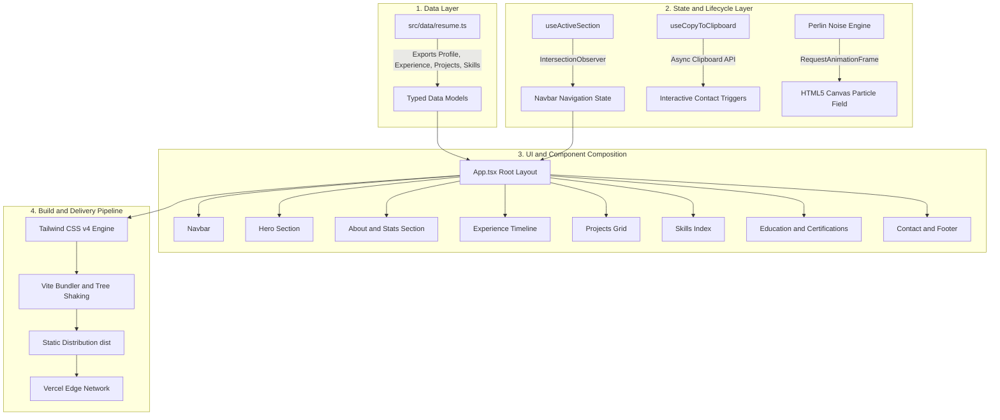

<div align="center">

# Namay Singh — AI/ML Engineer and Developer Portfolio

<p align="center">
  <strong>An editorial, scroll-driven interactive portfolio and resume built with modern web technologies.</strong>
</p>

[](https://react.dev/)
[](https://www.typescriptlang.org/)
[](https://tailwindcss.com/)
[](https://vitejs.dev/)
[](https://www.framer.com/motion/)
[](https://vercel.com/)

<br />

[Overview](#overview) • [Workflow and Architecture](#workflow-and-architecture) • [Key Features](#key-features) • [Tech Stack](#tech-stack) • [Quick Start](#quick-start) • [Deployment](#deployment-guide-vercel) • [Project Structure](#project-structure) • [Contact](#contact-and-connect)

</div>

---

## Overview

This repository contains the source code for the personal portfolio of Namay Singh, an AI/ML engineer and full-stack developer based in Bengaluru, India.

Designed with an editorial, monochrome agency aesthetic, the application transitions between light paper surfaces and dark high-contrast panels, featuring dynamic particle physics, micro-interactions, and a structured single source of truth data architecture.

---

## Workflow and Architecture

The application is structured into four decoupled layers to ensure maintainability, performance, and scalability.



### Execution Flow

1. **Data Ingestion**: All user data, metrics, experience history, and project details are loaded from `src/data/resume.ts`. No raw text is hardcoded inside UI components.
2. **Canvas and Particle Initialization**: The Hero section mounts a customized 2D HTML5 canvas that calculates a continuous Perlin noise flow field on `requestAnimationFrame` with zero external canvas dependencies.
3. **Viewport Tracking**: The custom `useActiveSection` hook registers `IntersectionObserver` instances on each section element, dynamically synchronizing scroll position with the header navigation indicator.
4. **Motion Orchestration**: Framer Motion handles staggered section reveals, scroll-based text resolutions, and hover state transitions.
5. **Compilation and Edge Distribution**: TypeScript types are validated (`tsc --noEmit`), Vite bundles and compresses assets, and the resulting static build is deployed directly to the Vercel Edge Network.

---

## Key Features

- **Editorial Monochrome Design**: Typographical scale featuring tight display headlines, italic accents, and monospaced labels.
- **Perlin Flow Field Particle Engine**: Interactive background canvas with fluid motion.
- **Dynamic Typewriter and Marquee**: Multi-role text rotator and continuous tech stack ticker.
- **Scroll-Driven Text Reveal**: Word-by-word paragraph animations powered by Framer Motion.
- **Single Source of Truth Architecture**: All resume content, projects, experience, education, and skills are decoupled into `src/data/resume.ts`.
- **Responsive and Accessible**: WCAG AA contrast compliance, keyboard navigation support, and reduced-motion handling.
- **Modern Build Tooling**: Built on React 19, Vite 6, and native Tailwind CSS v4.

---

## Tech Stack

| Domain | Technologies |
| :--- | :--- |
| **Core Framework** | React 19, TypeScript, Vite 6 |
| **Styling and Design** | Tailwind CSS v4, Custom CSS Variables |
| **Animations and Effects** | Framer Motion, Custom Perlin Canvas Engine |
| **Icons and Utilities** | Lucide React, clsx, tailwind-merge |
| **Deployment** | Vercel |

---

## Quick Start

### Prerequisites

Node.js 18 or higher is required.

```bash
node -v
npm -v
```

### Installation and Setup

1. Clone the repository:
   ```bash
   git clone https://github.com/namaysingh3925/cogks.git
   cd cogks/portfolio
   ```

2. Install dependencies:
   ```bash
   npm install
   ```

3. Start the development server:
   ```bash
   npm run dev
   ```

   The local application will run at `http://localhost:5173`.

### Production Build

To compile the application for production:

```bash
npm run build
```

To preview the production build locally:

```bash
npm run preview
```

---

## Project Structure

```text
portfolio/
├── index.html
├── vite.config.ts
├── package.json
└── src/
    ├── main.tsx
    ├── App.tsx
    ├── index.css
    ├── data/
    │   └── resume.ts
    ├── components/
    │   ├── Navbar.tsx
    │   ├── Hero.tsx
    │   ├── About.tsx
    │   ├── Experience.tsx
    │   ├── Projects.tsx
    │   ├── Skills.tsx
    │   ├── Education.tsx
    │   ├── Contact.tsx
    │   └── ui/
    │       ├── Layout.tsx
    │       ├── Display.tsx
    │       ├── PillButton.tsx
    │       ├── ScrollRevealText.tsx
    │       └── fluid-particles-background.tsx
    ├── hooks/
    │   ├── useActiveSection.ts
    │   └── useCopyToClipboard.ts
    └── lib/
        └── utils.ts
```

---

## Content Customization

To modify the portfolio contents, edit `src/data/resume.ts`:

- **Personal Information**: Update name, bio, social profiles, and email address.
- **Experience**: Edit professional background, roles, descriptions, and technology stacks.
- **Projects**: Manage project entries, descriptions, repository links, and live URLs.
- **Skills**: Configure skill proficiencies across categories (Frontend, Backend, ML / Data, Tools).
- **Education and Certifications**: Update academic qualifications and professional credentials.

---

## Deployment Guide (Vercel)

This project is configured for deployment on Vercel.

1. Push your repository to GitHub.
2. Navigate to Vercel and import the repository (`cogks`).
3. Set the following configuration parameters:
   - **Framework Preset**: `Vite`
   - **Root Directory**: `portfolio`
   - **Build Command**: `npm run build`
   - **Output Directory**: `dist`
4. Select **Deploy**.

---

## Contact and Connect

Namay Singh — AI/ML Engineer and Full-Stack Developer

- **LinkedIn**: [linkedin.com/in/namay-singh](https://www.linkedin.com/in/namay-singh-421160379/)
- **GitHub**: [github.com/namaysingh3925](https://github.com/namaysingh3925)
- **Email**: [namaysingh5@gmail.com](mailto:namaysingh5@gmail.com)

---

<div align="center">
  <sub>Built with React 19, Vite, and Tailwind CSS.</sub>
</div>
